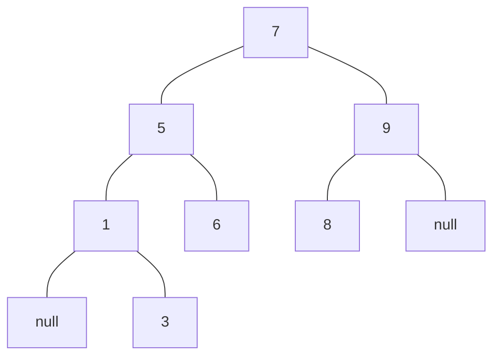
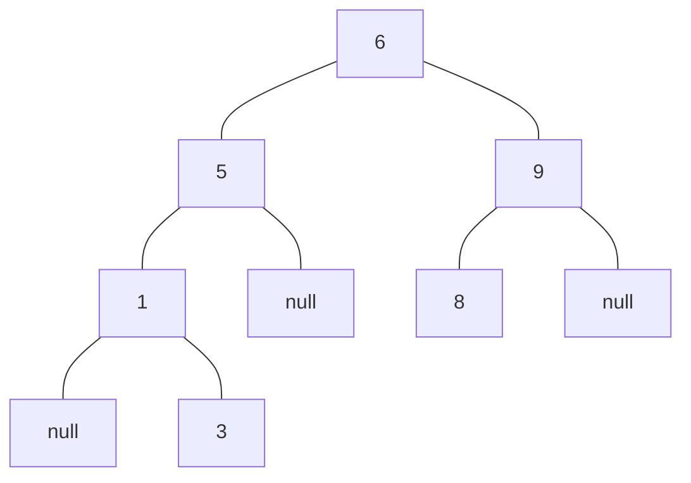
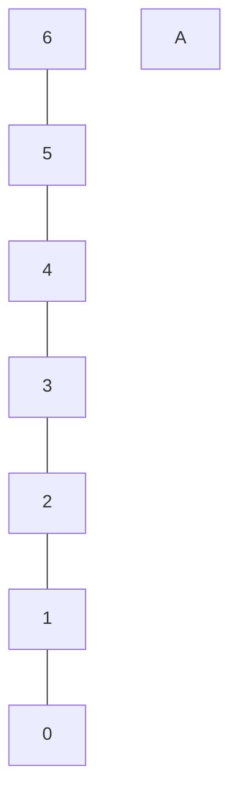
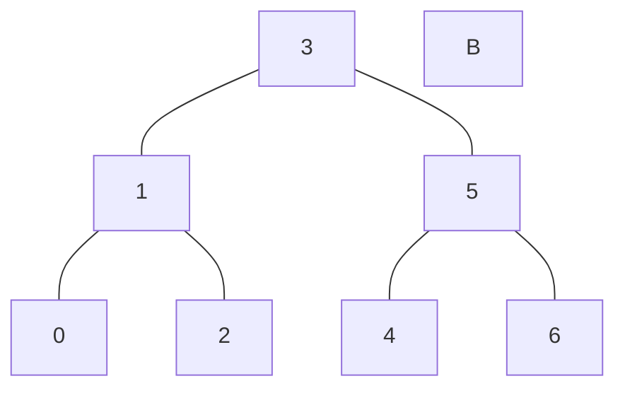

# 二叉排序树
### 废话：
我又来做笔记了！这次是跟着《大话数据结构》巩固了一些树方面的知识，然后来做以下二叉排序树的笔记，之后打算把什么A树B树黑树白树都看一下（好像大话数据结构里没有讲红黑树，但红黑树挺有意思的），也估计会一节一节的做笔记，我不得不说，数据结构是一个很有意思的东西（虽然我到现在都没有搞懂图），当然配合算法就更有意思了。
毕竟现在的网络世界就是构建在一个又一个天才般的数据结构和算法的基础之上嘛。
好！废话不多说，开始讲二叉排序树。（基本照着大话数据结构念）
***

## 树的介绍
这里就不过多介绍了

## 树的排序
树是可以不排序的，我告诉我自己，但不排序的树有什么用呢？大概就是存储一些关联性不强，然后也不会用到增删查改的 静态集合？

> 现在我确实不清楚不排序的树有什么用啊，之后估计也会随着兴趣爱好去了解学习一下，但现在就先原谅我这样讲吧

总之，我遇到了一个我非常喜欢的树，它叫二叉排序树，我为什么喜欢呢？有两个原因，一个是二叉，一个是排序。
二叉又叫二分，就是每个结点**最多有**两个孩子，左孩子和右孩子。如果了解过树的基本概念的话，那么二叉树不可能不知道。
那么排序是怎么个排序呢？
排序遵循三个原则：

> • 若它的左子树不空，则左子树上所有结点的值均小于它的根结构的值 
> 
> • 若它的右子树不空 ，则右子树上所有结点的值均大于宫的根结点的值;
> 
> • 它的左右子树也分别为二叉排序树

就是右边的比左边的大就完事了。
这里画一个二叉排序树（Binary Sort Tree）出来就很好理解了。

null表示结点为空，懂吧，我还不知道怎么用Markdown画树状图，马上去学！（学完了，cdsn上找不到可以很好表示左空右有的画法，但是！我用ProcessOn画了一个图，更好了解，下面贴出来。


二叉排序树是啥 知道之后咱就直接开始代码实现。
***
## 增删查
### Data Structure
首先是二叉树的数据结构代码：

```cpp
typedef struct BTNode
{
	int data;//实际存储数据，如果是模板树，则可以改为
	//template<T> ... { T data;  ... } ...,这里不多讲
	struct BTNode* lchild, * rchild;//左孩子，右孩子
	//初始化函数
	BTNode(int x):data(x),lchild(nullptr),rchild(nullptr){}
}BTNode, * BTree; 
/* 即
 typedef struct BTNode* BTree;
 typedef struct BTNode BTNode;
 //至于为什么要给BTNode取别名为BTNode这里我就不多说
 //我个人是认为可以不用加后面这个BTNode的
*/
```
### Search
然后来看一个二叉排序树的查找：

```cpp 
功能 ：递归查找二叉排序树cur中是否存在key 
      指针curFather指向cur的父节点，其初始调用值为nullptr
      若查找成功，则指针ret指向该数据元素节点，并返回true
      否则指针ret指向查找路径上最后一个节点并返回false
参数 cur： 需要查找的树
     key： 需要查找的结点的data值
     curFather： 需要查找的树的父结点
     ret： 传入一个树的指针，查找到则目标结点赋值在这个结果指针上
     未查找到则指像查找路径上最后一个结点
返回值 true： 查找成功
      false： 查找失败
bool SearchBST(BTree cur, int key, BTree curFather, BTree* ret)
{
	if (!cur) {//如果当前树为空（注：叶子结点的子树也为空）
		*ret = curFather;//结果树改为当前树的父结点
		return false;//返回查找失败
	}
	else if (key == cur->data) {//如果查找的key值等于当前树的data值
		*ret = cur;//结果树指针指向的地址处的值赋值为当前树
		//（算是一句话讲完指针？）
		return true;//返回查找成功
	}
	else if (key < cur->data)//如果查找的key值小于当前树的data值
		return SearchBST(cur->lchild, key, cur, ret);//去当前树的左子树中查找
	else//剩余情况：查找的key值大于当前树的data值
		return SearchBST(cur->lchild, key, cur, ret);//去当前树的右子树中查找
}
```
不多讲，一眼看懂。
树其实就是有很多个链接在一起的链表，只不过每个结点只有唯一的父节点，所以如果为了操作需要，可以在数据结构中加入父节点即

> BTNode * Father；

不过我这里还不需要。
所以树里面的查找就很容易出现在子树里面找子树。
对，我说的就是递归。把树给学通了，递归也就懂得差不多了。（个人理解）
***

### Insert
然后是插入，插入里面会调用到Search查找，所以记得前向声明或者头文件。
```cpp
功能 ：当二叉排序树cur中不存在关键字等于key的数据元素时
      插入key并返回true，否则返回false
参数 cur： 需要插入的树
     key： 需要插入的结点的data值
返回值 true： 插入成功
      false： 插入失败
bool InsertBST(BTree* cur, int key) {
	BTree ret, temp;
	if (!SearchBST(*cur, key, nullptr, &ret)) { //树中无相同元素
		temp = (BTree)malloc(sizeof(BTNode)); //给临时结点分配内存
		temp->data = key;                     //临时结点data赋值为key
		temp->lchild = temp->rchild = nullptr;//临时结点孩子置空
		if (!ret)//如果查找得到的结点也为空（即整颗树都为空）
			*cur = temp;           /* 插入temp为新节点 */
		else if (key < ret->data)//key比查找的结点data小
			ret->lchild = temp;    /* 插入temp为左孩子 */
		else                     //key比查找的结点data大
			ret->rchild = temp;    /* 插入temp为右孩子 */
		return true;    //插入成功
	}
	else
		return false;  //树中已含有值相同元素
}
```
这里主要理解一下ret的作用，在树中无相同元素的情况下，ret是搜索的树中目标结点的父节点，所以插入结点一定是插在ret下面，即插入结点一定是ret结点的子结点。
***
### Delete
然后是删除
删除操作的话，我们分为**实际删除操作**和**递归搜索删除操作**两个操作，我们先来看看**递归搜索删除操作**：

```cpp
功能： 若二叉排序树cur中存在关键字等于key的数据元素时，则删除该数据元素的节点
       删除成功则返回true，否则返回false
参数 cur：删除结点所在的树
     key：删除结点的data值
返回值 true： 删除成功
      false： 删除失败
bool DeleteBST(BTree* cur, int key) {
	if (!*cur) //无删除元素
		return false;
	else {
		if (key == (*cur)->data) // 如果查找到需要查找的结点
			return Delete(cur);// 调用*实际查找函数*
			//否则继续在子结点中递归查找
		else if (key < (*cur)->data)
			return DeleteBST(&(*cur)->lchild, key);
		else
			return DeleteBST(&(*cur)->rchild, key);
	}	
}
```
然后是**实际删除操作**

```cpp
功能： 从二叉排序树中删除节点p，并重接其左或右子树
参数 cur：删除的结点
返回值 true： 删除成功
      false： 删除失败
bool Delete(BTree* cur) {
	BTree temp, pre;
	temp = *cur;
	if ((*cur)->rchild == nullptr) { //若右子树为空，则只需重接其左子树 
		*cur = (*cur)->lchild;
		free(temp);
	}
	else if ((*cur)->lchild == nullptr) { //若左子树为空，则只需重接其右子树
		*cur = (*cur)->rchild;
		free(temp);
	}
	else                               //左右子树皆不为空
	{//寻找删除结点的左子树的最右子树，即最小前驱
		pre = (*cur)->lchild;          //待删除结点的左子树
		while (child->rchild)          //寻找和删除目标相差最小的前驱
		{
			temp = pre;                
			pre = pre->rchild;         //寻找最右子树
		}
		(*cur)->data = pre->data;      //pre指向被删节点的直接前驱
		if (temp != *cur)
			temp->rchild = pre->lchild;//重接temp的右子树
		else
			temp->lchild = pre->lchild;//重接temp的左子树
		free(pre);
	}
	return true;
}
```
好，可能不了解的同学看到这里就有点看不懂了。什么重接，什么最小前驱，那么我就用图的形式来讲解一下。

比如在上面这棵树中，我要删除1、3、6、8、8，这五个结点，是进入上面的if和else if分支的。其中，1进入无左子树分支,9进入无右子树分支，3、6、8则既无左子树也没有右子树，可以直接free，不过在代码实现上他们进入第一个if分支。
而5、9、7则两个子树都有，那么进入else分支。
**寻找最小前驱**
这里简单讲一下为什么要找最小前驱，因为比如我把7结点删除了，那么肯定需要一个结点来替代7这个位置的，不然这就从一棵树变成两棵树了，那么我们就要在树中已有的结点去寻找。但也不能随便寻找，因为我们这个是二叉排序树，它是有严格的排序规律的。那么什么数字能够代替7这个位置呢？我们可以在叶子结点里去找找，然后就看到6和8不错，这里给出用6代替7，然后将7结点删除的树状图：

先将6结点和7结点的位置交换，然后删除7结点，最后得到这个图。
可以发现它依然是符合排序规律的，左小右大。
我就举例的讲一下，要我抽象概念那样地讲那还是自己去看书吧。（反正我自己理解了就行，哼）
那么后面的代码就很好理解了。（况且我还标了注释，不过应该先不看注释理解一遍的，因为注释可能有误，只能用来辅助理解）
***
## 二叉平衡树的铺垫
这一节讲了二叉排序树，它排序了，很好，可以说在向完美接近了。

> 什么是完美？就是增删查改都快，遍历也快，什么都快，还不怎么耗内存。（就是什么时间复杂度啊，空间复杂度啊，之类的。）

排序有什么好处？
排序使我们在使用的时候可以用 二分法 来进行查找。
单纯的遍历查找，每个都问一遍，时间复杂度是$O(n)$
而二分查找，它不仅仅是只要问一半，而是$O(logn)$,也就是n被二分多少次会变成1或0。logn在趋势上是会比n/2还小的。
（这里就稍微讲讲我现在对算法的理解吧，之后还会深入学习的。）
但是，二叉排序树它可能存在一种情况：

看到这里可能就有人会问了，你发个链表过来干嘛，咱不是在讲树嘛。
对，我们是在讲树，这也确实是一棵树，而且它还是一棵二叉排序树（只是我没有区分左右子树）
那么各位的算法基础肯定都比我好，链表的查找什么的，时间复杂度在最坏的情况下，还是n。
也就是说，咱二分了和没二分没有区别。
是什么原因导致的呢？当然是因为这棵树就一根光棍的原因了，导致根本没有二分的必要（或者说二分无效果）。
怎么办呢？天才们总是有Solution的，我就让这个树自己变成最适合二分的树！
如下：

这两颗树存储的数据相同，而且都是二叉排序树，但是在二分查找时，A最多需要二分6次，而B最多只需要二分2次。
这还只是一棵简单的树，从理论上来讲，n越大，logn和n的差距就越明显。
就因为这个，使我们值得花一些时间来搞一个让这棵树变得平衡的方法。因为看上去就像天平的左右两边一样嘛。
所以我们把这种二分查找次数最小的树称之为二叉平衡树。

好，就介绍到这里。
然后我搞下我的github库（我从来没有把我的库弄得很好看过，555）
